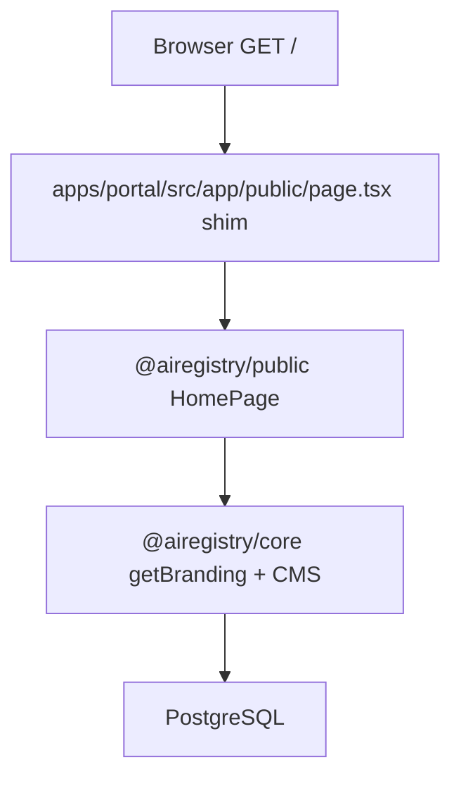

# Customizing an AI Registry deployment

This guide helps operators understand **monorepo structure**, **when to apply each customization layer**, and **how to customize the public portal** without modifying [`packages/core`](packages/core/) (the stable kernel). For package boundaries see [`GOVERNANCE.md`](GOVERNANCE.md) §11.

**Related docs:** [`README.md`](README.md) (overview), [`INSTALL.md`](INSTALL.md) (first-time setup), [`packages/public/README.md`](packages/public/README.md) (public UI package), [`apps/portal/README.md`](apps/portal/README.md) (Next.js host).

---

## Project structure

The reference implementation is a **pnpm + Turborepo monorepo**. The public portal you see at `http://localhost:3002/` is not a separate app — it is composed from these pieces:

| Path | Package | Responsibility |
|------|---------|----------------|
| [`apps/portal/`](apps/portal/) | `@airegistry/portal` | Next.js host: App Router routes, `/api/*`, layouts, admin/provider/verifier/sovereign workspaces |
| [`packages/public/`](packages/public/) | `@airegistry/public` | Public UI: pages, sections, site shell — **forkable** marketing site |
| [`packages/core/`](packages/core/) | `@airegistry/core` | Deployment config (`.env`), Prisma, `getBranding()`, public CMS, governance, APIs |
| [`packages/ui-kit/`](packages/ui-kit/) | `@airegistry/ui-kit` | Design tokens and shared components used by public + role portals |
| [`packages/plugin-host/`](packages/plugin-host/) | `@airegistry/plugin-host` | Extension loader (REST + UI slots) |
| [`extensions/`](extensions/) | `@airegistry/extension-*` | Optional in-tree plugins (e.g. [`extensions/examples/hello`](extensions/examples/hello/)) |

### How a browser request reaches the home page



1. **`apps/portal`** — Thin route file re-exports the page component, e.g. `export { HomePage as default } from "@airegistry/public/pages/HomePage"`.
2. **`@airegistry/public`** — Renders sections; server components call `getBranding()`; client sections use `usePublicBranding()` from `BrandingProvider` in `SiteShell`.
3. **`@airegistry/core`** — Merges `.env` + `SiteBranding` (DB) + defaults; reads public CMS tables for FAQ, how-it-works, etc.
4. **PostgreSQL** — Registry listings, providers, branding row, CMS content.

**Route groups** `(public)` and `(workspaces)` control layout/chrome only — they **do not appear in URLs**. `/registry` and `/admin` are siblings at the URL level.

| Route group | Example URLs | Chrome |
|-------------|--------------|--------|
| `(public)` | `/`, `/registry`, `/contact`, `/login` | `SiteShell` from `@airegistry/public` |
| `(workspaces)` | `/admin`, `/provider`, `/verifier`, `/sovereign` | Per-role workspace layout |
| `api/` | `/api/resources`, `/api/ext/hello/ping` | — |

---

## When to do what (operator checklist)

Use this order on a new deployment. Skip phases that do not apply.

| Phase | When | What to do | Where |
|-------|------|------------|-------|
| **A. Bootstrap** | First clone | Install deps, copy `.env`, Postgres, schema, seed | [`INSTALL.md`](INSTALL.md): `pnpm install`, `cp .env.example .env`, `pnpm db:push`, `pnpm db:seed`, `pnpm config:validate` |
| **B. Deployment identity** | Before go-live | Registry name, domain, jurisdiction, languages, operator | Root `.env` (required vars in `.env.example`) |
| **C. Branding** | After admin login | Logo, footer, contact, jurisdiction label, privacy act, repo URL | `/admin/branding` (overrides env where set) |
| **D. Home marketing** | Content pass | FAQ, how-it-works steps, listing criteria, promo banner | `/admin/site/faq`, `/admin/site/how-it-works`, `/admin/site/listing-criteria`, `/admin/site/promo` |
| **E. Live directory** | Operational | Real providers and resources | Admin/provider workflows; `/registry` and `/providers` read the DB |
| **F. Theme** | Visual pass | Colors, typography | CSS overrides after `@airegistry/ui-kit/tokens.css` |
| **G. Extensions** | Optional features | Extra REST routes or UI slots | `extensions/` + `PLUGINS_ENABLED`; set `false` to hide the hello demo |
| **H. Fork** | Deep copy or layout change | Replace marketing site or full portal | Fork [`packages/public`](packages/public/) and/or [`apps/portal`](apps/portal/) |

> **Note:** `.env` is gitignored. Operator secrets and deployment-specific values stay on the server, not in the repo.

---

## Public portal route map

Shims live under [`apps/portal/src/app/(public)/`](apps/portal/src/app/(public)/). Page bodies live in [`packages/public/src/pages/`](packages/public/src/pages/).

| URL | Page component | Primary customization |
|-----|----------------|----------------------|
| `/` | `HomePage.tsx` | Branding + CMS blocks + code sections (see home table below) |
| `/registry` | `RegistryListPage.tsx` | Branding + **live DB** (`/api/resources`) |
| `/registry/[slug]` | `RegistryDetailPage.tsx` | Live DB |
| `/providers` | `ProvidersListPage.tsx` | Branding + **live DB** |
| `/providers/[slug]` | `ProviderDetailPage.tsx` | Live DB |
| `/contact` | `ContactPage.tsx` | `getBranding()` operator/contact fields |
| `/ecosystem` | `EcosystemPage.tsx` | Mostly **code** (`EcosystemContent.tsx`); operator/repo/domain via branding |
| `/docs` | `DocsPage.tsx` | Branding (`portalDomain`); body in code |
| `/governance` | `GovernancePage.tsx` | Branding + code |
| `/privacy`, `/terms`, `/acceptable-use` | Legal pages | Branding + code (privacy act name configurable) |
| `/pricing`, `/whitepaper`, `/open-data`, … | Various | Branding for titles/metadata; body mostly code |
| `/login`, `/register`, `/auth/*` | Auth pages | Config + theme |

### Home page (`/`) section order

From [`packages/public/src/pages/HomePage.tsx`](packages/public/src/pages/HomePage.tsx):

| Order | Section | Customization source |
|-------|---------|----------------------|
| 1 | `Hero` | `/admin/branding` + env (`heroEyebrowText`, jurisdiction, headline accent) |
| 2 | `PluginSlot` `public.home.hero.below` | Extensions (`PLUGINS_ENABLED`; hello demo when on) |
| 3 | `RegistrySection` | Branding jurisdiction line + **mock preview rows in code** |
| 4 | `WhatGetsListed` | **Hardcoded** in TSX today |
| 5 | `ListingCriteria` | **Public CMS** `/admin/site/listing-criteria` |
| 6 | `HowItWorks` | **Public CMS** `/admin/site/how-it-works` |
| 7 | `Promo` | **Public CMS** `/admin/site/promo` (off until enabled in admin) |
| 8 | `Faq` | **Public CMS** `/admin/site/faq` |

---

## Quick decision guide

| What you want to change | Approach | Modify core? |
|------------------------|----------|--------------|
| Registry name, jurisdiction, languages, API URLs | Root [`.env`](.env.example) + `pnpm config:validate` | No |
| Operator name, contact email, office, hours on `/contact` and legal copy | `OPERATOR_NAME` (+ optional `OPERATOR_CONTACT_*` in `.env`) and `/admin/branding` | No |
| Jurisdiction name on heroes (`/`, `/registry`, `/providers`), privacy act, repo URL | `JURISDICTION_DISPLAY_NAME`, `PRIVACY_DATA_PROTECTION_ACT`, `OPEN_SOURCE_REPO_URL` and `/admin/branding` | No |
| Logos, footer copy, hero eyebrow | `/admin/branding` (DB `SiteBranding` + env fallbacks) | No |
| FAQ, how-it-works, listing criteria, promo banner | `/admin/site/*` (public CMS) | No |
| Colors, typography, spacing | Override [`@airegistry/ui-kit/tokens.css`](packages/ui-kit/src/tokens.css) | No |
| Marketing pages, public shell, home layout | Fork or replace [`@airegistry/public`](packages/public/) | No |
| New REST routes, UI slots | Add under [`extensions/`](extensions/) (see hello example) | Extend only |
| Admin/provider workflows, API route layout | Fork [`apps/portal`](apps/portal/) | No (keep core dep) |
| Data model, governance rules, audit primitive | Upstream PR to `@airegistry/core` | Yes |

---

## Layer 1 — Configuration and branding (no code)

### Step-by-step

1. Copy `.env.example` to `.env` and set required deployment variables (`REGISTRY_NAME`, `PORTAL_DOMAIN`, `OPERATOR_NAME`, `JURISDICTION`, `IDENTITY_DOMAIN`, `AUTH_SECRET`, etc.).
2. Optionally set operator and marketing defaults (all optional; sensible fallbacks apply when unset):
   - `OPERATOR_CONTACT_EMAIL` — sidebar on `/contact`
   - `OPERATOR_OFFICE_NAME` — defaults to `OPERATOR_NAME`
   - `OPERATOR_OFFICE_ADDRESS` — multiline; use `\n` between lines in `.env`
   - `OPERATOR_CONTACT_HOURS`
   - `JURISDICTION_DISPLAY_NAME` — e.g. `Mauritius` on list-page heroes and home H1 (defaults from `JURISDICTION` code when unset)
   - `PRIVACY_DATA_PROTECTION_ACT` — privacy page (defaults to `{jurisdiction} Data Protection Act 2017`)
   - `OPEN_SOURCE_REPO_URL` — footer and ecosystem GitHub links
3. Run `pnpm config:validate`.
4. Sign in as admin and open **`/admin/branding`** for DB overrides (registry name, logo, footer, hero chip, operator/contact, jurisdiction, privacy act, repo URL).
5. After pulling schema changes that extend `SiteBranding`, run `pnpm db:push`.

### Branding merge order

[`packages/core/src/lib/branding.ts`](packages/core/src/lib/branding.ts) composes a `Branding` object:

**Merge rule:** **DB (`SiteBranding`) → `.env` (`getConfig()`) → built-in default**

| Field | Typical source | Used on |
|-------|----------------|---------|
| `registryName` | env + admin | Titles, metadata, copy |
| `portalDomain`, `identityDomain` | env only | Eyebrow default, links, open data |
| `operatorName`, `operatorContactEmail`, office, hours | env + admin | `/contact`, legal pages, ecosystem |
| `jurisdictionDisplayName`, `heroHeadlineAccent` | env + admin + derived | Home/registry/providers heroes |
| `privacyDataProtectionAct` | env + admin | `/privacy` |
| `openSourceRepoUrl` | env + admin | Footer, ecosystem, open data |
| `logoUrl`, `copyrightLine`, `buildLine`, `heroEyebrowText` | admin + env | Shell, footer, hero |

**In components:**

- **Server pages/sections:** `await getBranding()` from `@airegistry/core/branding`
- **Client sections under `SiteShell`:** `usePublicBranding()` from [`packages/public/src/lib/branding-context.tsx`](packages/public/src/lib/branding-context.tsx)
- **Page titles:** `generateMetadata()` via [`packages/public/src/lib/page-metadata.ts`](packages/public/src/lib/page-metadata.ts)

---

## Layer 2 — Public CMS (no fork)

Editable marketing blocks live in the `public_cms` schema. Admins manage them at:

| Admin URL | Home section | Notes |
|-----------|--------------|-------|
| `/admin/site/faq` | `Faq` | Ordered FAQ entries; fallback copy if DB empty |
| `/admin/site/how-it-works` | `HowItWorks` | Ordered steps |
| `/admin/site/listing-criteria` | `ListingCriteria` | Sovereignty criteria cards |
| `/admin/site/promo` | `Promo` | Singleton banner; **disabled** on fresh seed until you enable it |

Run `pnpm db:push` and `pnpm db:seed` after pulling schema changes. Re-seed does not overwrite existing CMS rows, so admin edits survive `pnpm db:seed`.

---

## Layer 3 — Theming

Load a stylesheet after `@airegistry/ui-kit/tokens.css` (and optionally [`@airegistry/public/theme/theme.css`](packages/public/src/theme/theme.css)) that overrides CSS variables. Do not add hard-coded hex values in forked portal components when a token exists.

---

## Layer 4 — Extensions

Extensions ship an [`airegistry-plugin.json`](extensions/examples/hello/airegistry-plugin.json) validated against `@airegistry/sdk/plugin`.

- REST handlers mount at `/api/ext/<plugin-id>/...`
- UI slots use `<PluginSlot id="..." />` from `@airegistry/plugin-host/slot` (server pages; plugins loaded in root layout)

Reference: [`extensions/examples/hello/`](extensions/examples/hello/).

### Enable or disable

```bash
# Plugins load by default when unset. To hide the hello demo banner on home:
PLUGINS_ENABLED=false
```

When enabled, the hello extension renders below the hero at slot `public.home.hero.below` and exposes `GET /api/ext/hello/ping`. For production portals not using extensions yet, set `PLUGINS_ENABLED=false` in `.env`.

See also [`packages/plugin-host/README.md`](packages/plugin-host/README.md).

---

## Layer 5 — Fork the public site

The default app mounts public routes from **`apps/portal/src/app/(public)/`** as thin re-exports of `@airegistry/public/pages/*`.

To replace the marketing site:

1. Fork [`packages/public`](packages/public/) (keep the package name `@airegistry/public` or update `apps/portal` imports).
2. Leave `apps/portal` API routes and role workspaces (`app/(workspaces)/`) unchanged.

Use this layer when you need to change **What gets listed**, **ecosystem narrative**, **nav links**, **home section order**, or **mock preview data**.

---

## Layer 6 — Fork the full portal

Fork [`apps/portal`](apps/portal/) for deep changes to admin/provider/verifier/sovereign UX. Continue depending on `@airegistry/core` and `@airegistry/sdk`; avoid deep imports into `@airegistry/core/lib/...` (not SemVer-stable).

---

## What is not configurable without code

The public portal is **layered**, not a single “full CMS” switch. These areas still require editing `@airegistry/public` (or a fork):

| Area | File(s) | Why |
|------|---------|-----|
| “What gets listed” type cards | [`WhatGetsListed.tsx`](packages/public/src/sections/WhatGetsListed.tsx) | Static copy and samples in TSX |
| Ecosystem long-form copy | [`EcosystemContent.tsx`](packages/public/src/sections/EcosystemContent.tsx) | Large static narrative (operator/repo wired via branding) |
| Home registry/providers preview | [`RegistrySection.tsx`](packages/public/src/sections/RegistrySection.tsx), [`ProvidersSection.tsx`](packages/public/src/sections/ProvidersSection.tsx) | Demo mock rows until live data fills the UI |
| Globe / default flag art | [`Globe.tsx`](packages/public/src/sections/Globe.tsx), [`Hero.tsx`](packages/public/src/sections/Hero.tsx) | Bespoke visuals |
| Top navigation links | [`TopNav.tsx`](packages/public/src/shell/TopNav.tsx) | Fixed link structure |
| Legal / whitepaper body | `TermsPage`, `WhitepaperPage`, etc. | Full prose in code (branding hooks for operator/domain only) |
| Home section order | [`HomePage.tsx`](packages/public/src/pages/HomePage.tsx) | Fixed component sequence |

For these, use **Layer 5** (fork `packages/public`) or contribute upstream CMS coverage.

---

## Further reading

- [`packages/public/README.md`](packages/public/README.md) — public package layout and route list
- [`apps/portal/README.md`](apps/portal/README.md) — App Router shims and admin entry points
- [`packages/core/README.md`](packages/core/README.md) — kernel boundary
- [`packages/sdk/README.md`](packages/sdk/README.md) — extension API
- [`docs/open-source/extension-point-design.md`](docs/open-source/extension-point-design.md) — extension contract (draft)
- [`MIGRATION.md`](MIGRATION.md) — monorepo migration notes
