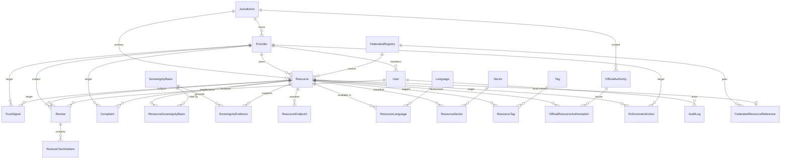

# AI Registry — Data model

This document extracts **entities**, **fields**, and **relationships** for the AI Registry. It aligns the **normative conceptual model** ([`.speckit/specification.md`](.speckit/specification.md), AIR-SPEC 0.4) with the **reference relational implementation** in [`ai-registry/src/prisma/schema.prisma`](../ai-registry/src/prisma/schema.prisma) (PostgreSQL schema `registry`).

**Normative vs implementation:** AIR-SPEC speaks in JSON-shaped aggregates (`governance`, `sovereignty_evidence`, `endpoints`). The reference implementation normalises many of those into tables (e.g. separate `TrustSignal`, `Review`, `SovereigntyEvidence` rows) so governance history, checklists, and queries remain auditable. Behavioural intent should match the specification; table names may differ in other stacks.

---

## 1. Conceptual aggregate (AIR-SPEC)

A **Resource** in the API is the merger of:

| Logical block | Meaning |
|----------------|---------|
| Identity & classification | Internal id, `registry_identity` (AIR-ID), `type`, `slug`, `version`, `jurisdiction`. |
| Localised text | Default `name` / `description`; optional `name_localized` / `description_localized` maps. |
| Provider link | `provider_id` → owning **Provider**. |
| Sovereignty | `sovereignty_basis` (multi-valued); `sovereignty_evidence` (structured list). |
| Type-specific | Model/modality; agent capabilities/dependencies; tool I/O schemas; skill `domain`, `regulatory_refs`, `package_url`, `manifest_url`, optional `contents_manifest`. |
| Endpoints | List of provider URLs, protocol, transport, `auth_hint`, terms. |
| Governance | `declaration_status`, `sovereignty_review_status`, `provider_verification_status`, review dates, reviewer, evidence_links, public/internal notes. |
| Lifecycle | Resource `status` (`draft` … `removed`). |
| Federation | Optional `origin_registry` (identity domain of source registry). |
| Audit | All mutating governance actions append to an audit trail (see §3.10). |

**Provider** holds legal/organisational identity and verification/suspension posture; **User** accounts link to a provider for self-service. **Configuration** (`identity_domain`, `api_base_url`, etc.) is deployment config, typically not stored as a single “entity row” in the reference app.

---

## 2. Entity relationship overview

### 2.1 Cardinality cheat sheet

| From | To | Cardinality | Semantics |
|------|-----|-------------|-----------|
| Provider | Resource | **1 : N** | Every listed resource belongs to exactly one provider; a provider owns many resources. |
| Jurisdiction | Provider | **1 : N** | Each provider declares a **home** jurisdiction (`homeJurisdictionId`). |
| Jurisdiction | Resource | **1 : N** | Each resource declares a **primary** jurisdiction (`primaryJurisdictionId`). |
| Resource | SovereigntyBasis | **M : N** | Via `ResourceSovereigntyBasis`: a resource cites multiple bases; each basis recurs across resources. |
| Resource | SovereigntyEvidence | **1 : N** | Evidence rows justify sovereignty claims per resource (and tie to one basis). |
| Resource | ResourceEndpoint | **1 : N** | Multiple externally hosted endpoints per resource. |
| Resource | Language / Sector / Tag | **M : N** | Via join tables for discovery filters and display. |
| User | Provider | **N : 1** (optional) | Provider-scoped users carry `providerId`; staff roles may have null provider. |
| Provider \| Resource | TrustSignal | **1 : N** (polymorphic) | `TrustSignal` targets **either** a provider or a resource via nullable FKs (mutually exclusive in use). |
| Resource \| Provider | Review | **1 : N** (polymorphic) | Reviews attach to a resource and/or provider depending on `reviewType`. |
| Review | ReviewChecklistItem | **1 : N** | Checklist captures AIR-SPEC §11 style yes/no outcomes. |
| OfficialAuthority | OfficialResourceAuthorisation | **1 : N** | An authority issues zero–many authorisations. |
| Resource | OfficialResourceAuthorisation | **1 : N** | Tracks official-resource pathway per authority. |
| Resource \| Provider | Complaint | **N : 1** (optional targets) | Complaints reference a resource and/or provider under investigation. |
| Complaint | EnforcementAction | **1 : N** | Enforcement rows may stem from a complaint. |
| Resource \| Provider | EnforcementAction | **1 : N** | Actions may target resource/provider directly even without a complaint. |
| FederatedRegistry | Resource | **1 : N** | Imported/mirrored resources may reference `sourceRegistryId`; local origin still `listingOrigin`. |
| FederatedRegistry | FederatedResourceReference | **1 : N** | Metadata-only federation links (`source_air_id`) to optional local mirror. |
| Resource | FederatedResourceReference | **1 : 1** (optional) | `localResourceId` binds a foreign AIR-ID reference to a local `Resource` if displayed. |
| Resource | RuntimeIdentityBinding | **1 : N** | Optional future/bindings linking AIR-ID to runtime identity strings (outside SPIRE scope for registry ops). |
| User | AuditLog | **1 : N** | Actor linkage; audit also supports null actor for system events if policy allows. |

### 2.2 ER diagram (core aggregates)

---

## 3. Reference implementation entities and fields

All models below live in PostgreSQL schema **`registry`**. Types follow Prisma notation. **FK** marks a foreign key to another table in this document.

### 3.1 Controlled vocabulary (reference tables)

Each reference table follows the pattern: `id`, `code` (unique), `name`, `description?`, `active`, `sortOrder`, `createdAt`, `updatedAt` (except where noted). They replace SQL enums so values can evolve without migrations.

| Model | Referenced by | Purpose |
|-------|----------------|---------|
| `UserRoleType` | `User`, `UserRoleAssignment` | Portal role codes (admin, operator, provider, etc.). |
| `UserStatusType` | `User` | Account lifecycle. |
| `ProviderTypeRef` | `Provider` | Company, government, individual, … |
| `ProviderStatusType` | `Provider` | Provider lifecycle / suspension. |
| `ResourceType` | `Resource` | model · agent · tool · skill. |
| `LifecycleStatus` | `Resource` | Draft → listed → deprecated/removed (implementation may use more granular codes than AIR-SPEC labels alone). |
| `RiskLevel` | `Resource` | Risk classification for moderation. |
| `ListingOrigin` | `Resource` | Local vs federated vs imported reference. |
| `EvidenceType` | `SovereigntyEvidence` | law, dataset, institution, … |
| `JurisdictionType` | `Jurisdiction` | Country, region, city, … |
| `TrustSignalType` | `TrustSignal` | Provider verified, sovereignty reviewed, official resource. |
| `TrustSignalStatusType` | `TrustSignal` | Requested, approved, revoked, … |
| `ReviewType` | `Review` | Completeness, sovereignty, official resource, … |
| `ReviewStatusType` | `Review` | Pending, approved, rejected, … |
| `ChecklistResultType` | `ReviewChecklistItem` | Pass / fail / N/A for rubric items. |
| `Protocol` | `ResourceEndpoint` | rest, mcp, graphql, … |
| `AccessModelType` | `ResourceEndpoint` | open, restricted, … |
| `AuthMethodType` | `ResourceEndpoint` | none, api_key, oauth2, mtls, … |
| `EndpointHealthType` | `ResourceEndpoint` | Last probe result. |
| `OfficialAuthorityType` | `OfficialAuthority` | Ministry, regulator, … |
| `OfficialAuthorisationStatusType` | `OfficialResourceAuthorisation` | Requested, approved, revoked, … |
| `ComplaintType` | `Complaint` | Taxonomy of complaint. |
| `ComplaintSeverityType` | `Complaint` | Severity. |
| `ComplaintStatusType` | `Complaint` | Workflow state. |
| `EnforcementType` | `EnforcementAction` | Warning, suspension, removal, … |
| `SubmissionSourceType` | `Provider` | How the provider record was created. |
| `SovereigntyBasis` | `ResourceSovereigntyBasis`, `SovereigntyEvidence` | Four canonical bases (local law, data, system, language/culture). |

---

### 3.2 `User`

Registry account for humans (and optional service principals if extended). Links to **Provider** for submitter workflows.

| Field | Type | Description |
|-------|------|-------------|
| `id` | UUID | Primary key. |
| `email` | String | Unique login identifier. |
| `passwordHash` | String? | Nullable when OAuth-only. |
| `name` | String | Display name. |
| `organisationName` | String? | Optional org label. |
| `roleId` | String **FK** | → `UserRoleType`. |
| `statusId` | String **FK** | → `UserStatusType`. |
| `providerId` | String? **FK** | → `Provider`; null for operator-only users. |
| `emailVerified` | Boolean | Verification flag. |
| `verificationToken` | String? | Email verification. |
| `verificationTokenExpiry` | DateTime? | Token TTL. |
| `resetToken` | String? | Password reset. |
| `resetTokenExpiry` | DateTime? | Reset TTL. |
| `onboardingComplete` | Boolean | Gating dashboard access. |
| `image` | String? | Avatar URL. |
| `createdAt` | DateTime | |
| `updatedAt` | DateTime | |

**Relationships:** Many `Account` rows (OAuth); many `AuditLog` as actor; optional `UserRoleAssignment` rows for scoped roles; optional participation as reviewer, evidence submitter, trust-signal decider, assignee on complaints, performer of enforcement; links to submitted sovereignty bases/evidence via optional FKs on those child tables.

---

### 3.3 `Account`

NextAuth OAuth account binding.

| Field | Type | Description |
|-------|------|-------------|
| `id` | String (UUID) | PK. |
| `userId` | UUID **FK** | → `User` (cascade delete). |
| `type`, `provider`, `providerAccountId` | String | OAuth provider identifiers. |
| `accessToken`, `refreshToken`, `expiresAt`, `tokenType`, `scope`, `idToken` | Various | Tokens as needed. |

**Relationship:** Many-to-one **`User`** (composite unique on `provider` + `providerAccountId`).

---

### 3.4 `UserRoleAssignment`

Additional roles with optional jurisdictional/provider/sector scope.

| Field | Type | Description |
|-------|------|-------------|
| `id` | String | PK. |
| `userId` | UUID **FK** | → `User`. |
| `roleId` | String **FK** | → `UserRoleType`. |
| `scopeJurisdictionId` | String? | Optional scope. |
| `scopeProviderId` | String? | Optional scope. |
| `scopeSectorId` | String? | Optional scope. |
| `assignedAt` | DateTime | |
| `assignedById` | UUID? | Assigning user. |

**Relationship:** Extends **`User`** with scoped privileges; unique on (`userId`, `roleId`, scope triple).

---

### 3.5 `Jurisdiction`

Geographic or legal scope for providers, resources, and official authorities. Tree via self-FK.

| Field | Type | Description |
|-------|------|-------------|
| `id` | String | PK. |
| `code` | String | Unique stable code (e.g. ISO). |
| `name` | String | Display name. |
| `typeId` | String **FK** | → `JurisdictionType`. |
| `parentJurisdictionId` | String? **FK** | → `Jurisdiction` (hierarchy). |
| `active` | Boolean | Soft-disable. |
| `createdAt`, `updatedAt` | DateTime | |

**Relationships:** One **parent**, many **children**; one-to-many **`Provider`** (home); one-to-many **`Resource`** (primary); one-to-many **`OfficialAuthority`**; one-to-many **`FederatedRegistry`**.

---

### 3.6 `Provider`

Legal and commercial identity of the party responsible for resources.

| Field | Type | Description |
|-------|------|-------------|
| `id` | String | PK. |
| `slug` | String | Unique; used in AIR-ID path segment. |
| `displayName` | String | Public name. |
| `legalName` | String? | Registered name. |
| `typeId` | String **FK** | → `ProviderTypeRef`. |
| `homeJurisdictionId` | String **FK** | → `Jurisdiction`. |
| `websiteUrl`, `documentationUrl` | String? | |
| `contactEmail` | String | Primary contact. |
| `legalContactEmail` | String? | |
| `registrationNumber` | String? | Company/registry id. |
| `description` | String? | |
| `statusId` | String **FK** | → `ProviderStatusType`. |
| `published` | Boolean | Listing visibility helper. |
| `adminSuspended` | Boolean | Operator suspension flag. |
| `srcId` | String **FK** | → `SubmissionSourceType`. |
| `createdAt`, `updatedAt` | DateTime | |

**Relationships:**

- **Home jurisdiction:** Mandatory FK to **`Jurisdiction`** — anchors sovereignty and policy context for the organisation.
- **Resources:** **`Resource.providerId`** implements AIR-SPEC `provider_id`; **1:N** cascade governs listing ownership.
- **Users:** Provider team **`User`** rows share **`providerId`** — enables separation-of-duties (same user cannot approve own provider’s sovereignty signal).
- **Trust signals targeting provider:** **`TrustSignal.targetProviderId`** — models provider-level verification posture (maps to AIR-SPEC `provider_verification_status` in aggregate/API).
- **Reviews / complaints:** Optional **`Review.providerId`**, **`Complaint.targetProviderId`** — governance and moderation touchpoints.
- **Enforcement:** **`EnforcementAction.targetProviderId`** — operator actions at provider scope.

---

### 3.7 `Resource`

Central registry row for a model, agent, tool, or skill.

| Field | Type | Description |
|-------|------|-------------|
| `id` | String | PK. |
| `airId` | String? | Unique; **null until listed**; AIR-SPEC `registry_identity`. |
| `slug` | String | Unique per provider; AIR-ID segment. |
| `title` | String | Default-language title (maps to `name`). |
| `shortDescription` | String | Summary. |
| `longDescription` | String? | Body text. |
| `resourceTypeId` | String **FK** | → `ResourceType`. |
| `providerId` | String **FK** | → `Provider`. |
| `primaryJurisdictionId` | String **FK** | → `Jurisdiction`. |
| `listingOriginId` | String **FK** | → `ListingOrigin`. |
| `sourceRegistryId` | String? **FK** | → `FederatedRegistry` when mirrored. |
| `sourceAirId` | String? | Peer registry AIR-ID. |
| `accessUrl`, `sourceCodeUrl`, `documentationUrl`, `termsUrl` | String? | Convenience URLs. |
| `license` | String? | |
| `versionLabel`, `versionNumber` | String? | AIR-SPEC `version`. |
| `lifecycleStatusId` | String **FK** | → `LifecycleStatus`. |
| `riskLevelId` | String **FK** | → `RiskLevel`. |
| `publicVisibility` | Boolean | Gate public discovery (with status/provider rules). |
| `submittedAt`, `listedAt` | DateTime? | Workflow timestamps. |
| `lastProviderUpdateAt` | DateTime? | |
| `lastReviewedAt`, `nextReviewDueAt` | DateTime? | Align with governance cadence. |
| `createdAt`, `updatedAt` | DateTime | |

**Unique:** (`providerId`, `slug`).

**Relationships:**

- **Provider (N:1):** Owning organisation; deletion policy typically **restrict** so providers cannot be removed with live resources.
- **Jurisdiction (N:1):** Declared scope for sovereignty and filters.
- **Type & lifecycle (N:1):** Drive required fields and public visibility rules.
- **Federation (N:1 optional):** `sourceRegistryId` + `sourceAirId` preserve **origin**; public copy should not imply local trust without policy.
- **Sovereignty M:N:** **`ResourceSovereigntyBasis`** enumerates cited bases.
- **Evidence 1:N:** **`SovereigntyEvidence`** carries structured citations (**AIR-SPEC** `sovereignty_evidence[]`).
- **Endpoints 1:N:** **`ResourceEndpoint`** — AIR-SPEC endpoint list; registry never proxies these URLs.
- **Discovery facets M:N:** **`ResourceLanguage`**, **`ResourceSector`**, **`ResourceTag`** — search filters and multilingual hints (complement eventual JSON localisation tables if added).
- **Trust signals 1:N:** Rows with **`targetResourceId`** — resource-scoped badges (sovereignty reviewed, official resource, etc.).
- **Reviews 1:N:** Sovereignty/completeness workflows with **`ReviewChecklistItem`** children.
- **Official path 1:N:** **`OfficialResourceAuthorisation`** links **`OfficialAuthority`** to resource.
- **Complaints / enforcement:** **`Complaint`**, **`EnforcementAction`** optional FKs target the resource row under dispute or action.

---

### 3.8 `Sector`, `Language`, `Tag`

Facet dimensions for UX and `/discover`-style queries.

| Model | Fields (non-generic) |
|-------|---------------------|
| `Sector` | `code` unique, `name`, `description?`, `active`, timestamps. |
| `Language` | `code` unique (ISO-like), `name`, `active`, timestamps. |
| `Tag` | `name` unique, `description?`, `createdAt`. |

**Join tables:**

- **`ResourceSector`** — PK (`resourceId`, `sectorId`); both FKs cascade on delete of parent row.
- **`ResourceLanguage`** — PK (`resourceId`, `languageId`).
- **`ResourceTag`** — PK (`resourceId`, `tagId`).

**Relationship narrative:** These are **orthogonal taxonomies** attached to **`Resource`** for filtering. They do not imply trust; trust remains in **`TrustSignal`** / **`OfficialResourceAuthorisation`**.

---

### 3.9 `SovereigntyBasis` and `ResourceSovereigntyBasis`

| Model | Key fields |
|-------|------------|
| `SovereigntyBasis` | `code` unique, `name`, `description?`, `active`, `createdAt`. |
| `ResourceSovereigntyBasis` | Composite PK (`resourceId`, `sovereigntyBasisId`); optional `submittedById` → `User`; `createdAt`. |

**Relationship:** **M:N** between **`Resource`** and **`SovereigntyBasis`**. Each link means “this resource claims this basis.” Evidence rows (**`SovereigntyEvidence`**) should reference the same basis for traceability.

---

### 3.10 `SovereigntyEvidence`

Concrete citations backing sovereignty claims.

| Field | Type | Description |
|-------|------|-------------|
| `id` | String | PK. |
| `resourceId` | String **FK** | → `Resource` (cascade). |
| `sovereigntyBasisId` | String **FK** | → `SovereigntyBasis`. |
| `evidenceTypeId` | String **FK** | → `EvidenceType`. |
| `title` | String | Short label. |
| `description` | String? | Narrative. |
| `referenceUrl` | String? | AIR-SPEC optional `url`. |
| `referenceIdentifier` | String? | Citation string. |
| `issuingBody` | String? | Institution / issuer. |
| `publicVisibility` | Boolean | Hide sensitive notes from public API if false. |
| `submittedById` | UUID? **FK** | → `User`. |
| `createdAt`, `updatedAt` | DateTime | |

**Relationships:** Mandatory parent **`Resource`** and **`SovereigntyBasis`**; **evidence type** narrows AIR-SPEC `type` enum; optional **`User`** attribution for audits.

---

### 3.11 `ResourceEndpoint`

| Field | Type | Description |
|-------|------|-------------|
| `id` | String | PK. |
| `resourceId` | String **FK** | → `Resource` (cascade). |
| `protocolId` | String **FK** | → `Protocol`. |
| `endpointUrl` | String | Provider URL (not fetched by registry except optional health probe). |
| `documentationUrl` | String? | |
| `authMethodId` | String **FK** | → `AuthMethodType`. |
| `accessModelId` | String **FK** | → `AccessModelType`. |
| `primary` | Boolean | Prefer this endpoint in UIs. |
| `active` | Boolean | |
| `lastCheckedAt` | DateTime? | Probe time. |
| `lastCheckStatusId` | String **FK** | → `EndpointHealthType`. |
| `createdAt`, `updatedAt` | DateTime | |

**Relationship:** **Many endpoints per resource** capture multiple protocols (REST + MCP, etc.). This is the persistent form of AIR-SPEC `endpoints[]`.

---

### 3.12 `TrustSignal`

Implements **separable** trust metadata (provider verification, sovereignty reviewed, official resource) as first-class rows with validity window — closer to legal evidence than a single JSON blob.

| Field | Type | Description |
|-------|------|-------------|
| `id` | String | PK. |
| `kindId` | String **FK** | → `TrustSignalType`. |
| `targetProviderId` | String? **FK** | → `Provider` (cascade). |
| `targetResourceId` | String? **FK** | → `Resource` (cascade). |
| `statusId` | String **FK** | → `TrustSignalStatusType`. |
| `decisionSummary` | String? | |
| `publicNote`, `internalNote` | String? | |
| `validFrom`, `validUntil` | DateTime? | Public display window. |
| `decidedAt` | DateTime? | |
| `decidedById` | UUID? **FK** | → `User`. |
| `authorityOrganisation` | String? | Human-readable authority label. |
| `nextReviewDueAt` | DateTime? | |
| `createdAt`, `updatedAt` | DateTime | |

**Relationship (polymorphic target):** Exactly one of **`targetProviderId`** or **`targetResourceId`** should be set for a given signal **kind** in normal operation — provider-level verification vs resource-level badges. Maps to AIR-SPEC **`provider_verification_status`** (when provider-scoped) and resource governance fields when combined with lifecycle and **`OfficialResourceAuthorisation`**.

---

### 3.13 `Review` and `ReviewChecklistItem`

Structured review processes (completeness, sovereignty rubric, etc.).

**`Review`**

| Field | Type | Description |
|-------|------|-------------|
| `id` | String | PK. |
| `resourceId` | String? **FK** | → `Resource` (cascade). |
| `providerId` | String? **FK** | → `Provider` (cascade). |
| `reviewTypeId` | String **FK** | → `ReviewType`. |
| `statusId` | String **FK** | → `ReviewStatusType`. |
| `reviewerId` | UUID? **FK** | → `User`. |
| `reviewPanel` | String? | |
| `startedAt`, `completedAt` | DateTime? | |
| `decisionSummary`, `conditions` | String? | |
| `internalNotes` | String? | |
| `createdAt`, `updatedAt` | DateTime | |

**`ReviewChecklistItem`**

| Field | Type | Description |
|-------|------|-------------|
| `id` | String | PK. |
| `reviewId` | String **FK** | → `Review` (cascade). |
| `itemCode` | String | Stable key (maps to rubric item). |
| `question` | String | Prompt text. |
| `resultId` | String? **FK** | → `ChecklistResultType`. |
| `comment` | String? | |
| `createdAt`, `updatedAt` | DateTime | |

**Relationships:** **`Review`** is **polymorphic** like complaints — can hang off **resource** and/or **provider** depending on type. **Checklist items** realise AIR-SPEC **§11** reviewer questions. **`User.reviewerId`** must respect separation-of-duties at the application layer.

---

### 3.14 `OfficialAuthority` and `OfficialResourceAuthorisation`

**`OfficialAuthority`**

| Field | Type | Description |
|-------|------|-------------|
| `id` | String | PK. |
| `jurisdictionId` | String **FK** | → `Jurisdiction`. |
| `name` | String | |
| `typeId` | String **FK** | → `OfficialAuthorityType`. |
| `domainArea` | String | Scope text. |
| `websiteUrl`, `contactEmail` | String? | |
| `active` | Boolean | |
| `createdAt`, `updatedAt` | DateTime | |

**`OfficialResourceAuthorisation`**

| Field | Type | Description |
|-------|------|-------------|
| `id` | String | PK. |
| `resourceId` | String **FK** | → `Resource` (cascade). |
| `officialAuthorityId` | String **FK** | → `OfficialAuthority`. |
| `statusId` | String **FK** | → `OfficialAuthorisationStatusType`. |
| `authorisationReference` | String? | External ref. |
| `authorisationDocumentUrl` | String? | |
| `validFrom`, `validUntil` | DateTime? | |
| `publicNote`, `internalNote` | String? | |
| `decidedById` | UUID? **FK** | → `User`. |
| `decidedAt` | DateTime? | |
| `createdAt`, `updatedAt` | DateTime | |

**Relationship narrative:** **`OfficialAuthority`** is a **directory of competent bodies** per jurisdiction. **`OfficialResourceAuthorisation`** is the **many-to-many realisation** between **Resource** and **Authority** with its own status and evidence URLs — this backs **official-resource** elevation **together with** provider verification rules in the spec.

---

### 3.15 `Complaint` and `EnforcementAction`

**`Complaint`**

| Field | Type | Description |
|-------|------|-------------|
| `id` | String | PK. |
| `targetResourceId` | String? **FK** | → `Resource`. |
| `targetProviderId` | String? **FK** | → `Provider`. |
| `complaintTypeId` | String **FK** | → `ComplaintType`. |
| `severityId` | String **FK** | → `ComplaintSeverityType`. |
| `complainantName`, `complainantEmail` | String? | PII minimisation per policy. |
| `description` | String | |
| `statusId` | String **FK** | → `ComplaintStatusType`. |
| `assignedToId` | UUID? **FK** | → `User`. |
| `resolutionSummary` | String? | |
| `submittedAt`, `resolvedAt` | DateTime? | |
| `createdAt`, `updatedAt` | DateTime | |

**`EnforcementAction`**

| Field | Type | Description |
|-------|------|-------------|
| `id` | String | PK. |
| `relatedComplaintId` | String? **FK** | → `Complaint`. |
| `targetResourceId` | String? **FK** | → `Resource`. |
| `targetProviderId` | String? **FK** | → `Provider`. |
| `actionTypeId` | String **FK** | → `EnforcementType`. |
| `reason` | String | |
| `performedById` | UUID? **FK** | → `User`. |
| `performedAt` | DateTime | |
| `publicNote`, `internalNote` | String? | |
| `createdAt` | DateTime | |

**Relationships:** Complaints **optionally dual-target** resource and provider (e.g. “misleading listing” vs “organisation fraud”). **`EnforcementAction`** may chain from a complaint or stand alone for operator-initiated remediation; either way it should emit **`AuditLog`** entries.

---

### 3.16 `AuditLog`

Append-oriented governance telemetry (AIR-SPEC §18.1 alignment).

| Field | Type | Description |
|-------|------|-------------|
| `id` | String | PK. |
| `actorUserId` | UUID? **FK** | → `User`. |
| `entityType` | String | Logical type name (resource, provider, …). |
| `entityId` | String | Target id. |
| `action` | String | Verb code. |
| `previousValue`, `newValue` | Json? | State snapshots / diffs. |
| `ipAddress`, `userAgent` | String? | Request context. |
| `createdAt` | DateTime | Immutable timestamp. |

**Relationship:** **Loosely coupled** — no FK to every entity by design (polymorphic `entityType` + `entityId`). **`User`** optional for system jobs. Indexes support (`entityType`, `entityId`) and time-range queries for auditors.

---

### 3.17 `RuntimeIdentityBinding`

Optional future use: correlate **`Resource`** with non-registry identity strings (**not** AIR-ID issuance).

| Field | Type | Description |
|-------|------|-------------|
| `id` | String | PK. |
| `resourceId` | String **FK** | → `Resource` (cascade). |
| `identityType` | String | e.g. spiffe hint (document only). |
| `identityValue` | String | |
| `issuer`, `hostingProvider` | String? | |
| `validFrom`, `validUntil` | DateTime? | |
| `status` | String | Default `ACTIVE`. |
| `createdAt`, `updatedAt` | DateTime | |

**Relationship:** **1:N from Resource** — hosting providers may mirror bindings; registry does **not** operate SPIRE.

---

### 3.18 `FederatedRegistry` and `FederatedResourceReference`

Schema hooks for bilateral federation (non-MVP workflows).

**`FederatedRegistry`**

| Field | Type | Description |
|-------|------|-------------|
| `id` | String | PK. |
| `registryCode` | String | Unique peer code. |
| `name` | String | |
| `jurisdictionId` | String **FK** | → `Jurisdiction`. |
| `baseUrl`, `discoveryApiUrl` | String | Peer endpoints. |
| `status` | String | Default `PROPOSED`. |
| `trustModel` | String | Default `METADATA_ONLY`. |
| `agreementReference`, `agreementUrl` | String? | |
| `validFrom`, `validUntil` | DateTime? | |
| `createdAt`, `updatedAt` | DateTime | |

**`FederatedResourceReference`**

| Field | Type | Description |
|-------|------|-------------|
| `id` | String | PK. |
| `sourceRegistryId` | String **FK** | → `FederatedRegistry` (cascade). |
| `sourceAirId` | String | Peer AIR-ID. |
| `localResourceId` | String? **FK** | → `Resource`. |
| `sourceJurisdiction` | String? | |
| `sourceTrustLabels` | Json? | Serialized peer labels (**do not** auto-map to local trust). |
| `localReviewStatus` | String? | |
| `lastSyncedAt` | DateTime? | |
| `syncStatus` | String | |
| `publicDisplayNote` | String? | |
| `createdAt`, `updatedAt` | DateTime | |

Unique (`sourceRegistryId`, `sourceAirId`).

**Relationships:** **`Resource.sourceRegistryId`** links a **full local row** mirrored from a peer. **`FederatedResourceReference`** supports **lazy** or **display-only** links without a complete local resource. **`sourceTrustLabels`** stored as **`Json`** keeps peer badges **explicitly sourced** — satisfies “federated listings do not automatically inherit local trust” from the constitution.

---

## 4. Mapping AIR-SPEC JSON → tables (quick reference)

| AIR-SPEC (conceptual) | Primary storage in reference impl. |
|------------------------|------------------------------------|
| `registry_identity` (AIR-ID) | `Resource.airId` |
| `provider_id` | `Resource.providerId` → `Provider` |
| `sovereignty_basis[]` | `ResourceSovereigntyBasis` |
| `sovereignty_evidence[]` | `SovereigntyEvidence` |
| `endpoints[]` | `ResourceEndpoint` |
| `governance.declaration_status` / review fields | Derived from **`LifecycleStatus`**, **`TrustSignal`** rows, **`Review`**, notes on resource or signals API layer |
| `governance.provider_verification_status` | Provider-scoped **`TrustSignal`** (+ `Provider.statusId`) |
| `governance.sovereignty_review_status` | Resource reviews + checklist + sovereignty **`TrustSignal`** / API projection |
| `governance.official_resource` semantics | **`OfficialResourceAuthorisation`** + resource lifecycle + official **`TrustSignal`** |
| `name_localized` / `description_localized` | Not a separate table in current schema — may be implemented as JSON columns or related localisation rows in a future revision |
| `origin_registry` | `Resource.sourceRegistryId` / `SourceAirId` / `ListingOrigin` |

---

## 5. Indexes and integrity (summary)

- **Uniqueness:** `Provider.slug`; `Resource` (`providerId`,`slug`); `Resource.airId`; `User.email`; `Jurisdiction.code`; federation (`sourceRegistryId`,`sourceAirId`).
- **Query paths:** FK indexes on **`Resource`** (`providerId`, `lifecycleStatusId`, `primaryJurisdictionId`, `publicVisibility`) power directory search.
- **`AuditLog`** indexed by (`entityType`,`entityId`) and `createdAt` for investigations.

---

## 6. Related documents

| Document | Role |
|---------|------|
| [`.speckit/specification.md`](.speckit/specification.md) | Normative MVP behaviour and API. |
| [`.speckit/constitution.md`](.speckit/constitution.md) | Architectural rules (listing vs endorsement, federation trust). |
| [`README.md`](README.md) | How this specs repo relates to [`ai-registry`](../ai-registry/). |
| [`ai-registry/specs.md`](../ai-registry/specs.md) | Full operating specification for the reference Registry app. |
| [`ai-registry/README.md`](../ai-registry/README.md) | Quick start, scripts, REST table, MCP tools list. |
| [`ai-registry/specs/001-ai-registry/data-model.md`](../ai-registry/specs/001-ai-registry/data-model.md) | Feature-level implementation notes and code lists. |
| [`ai-registry/src/prisma/schema.prisma`](../ai-registry/src/prisma/schema.prisma) | Authoritative DDL shape for the reference build. |
